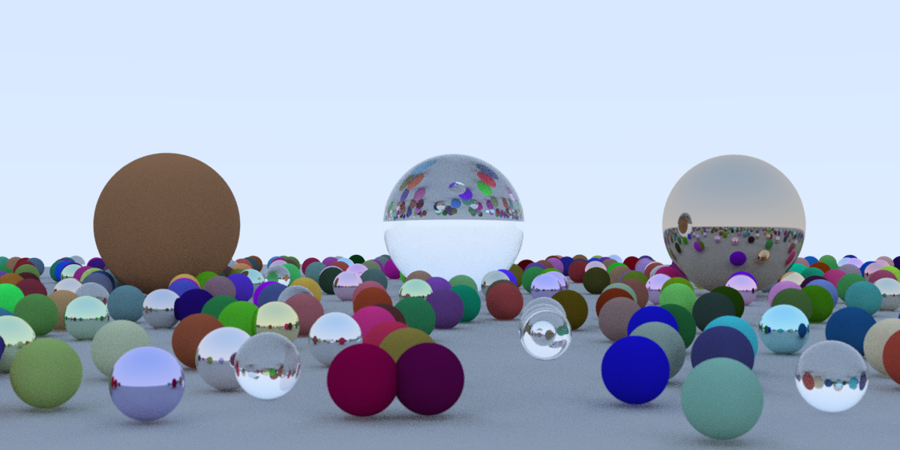

# raytracing-bend2

Ray tracing in a weekend in [Bend 2](https://github.com/bendlang/bend), ported from
[raytracing-nim](https://github.com/aguspiza/raytracing-nim).



## Run

Bend compiles through clang, so build and run it in WSL or on Linux:

```
bend main.bend -o ray
./ray                 # 64 samples per pixel -> ray.tga
./ray 16              # 16 samples per pixel
./ray 16 ppm          # also write ray.ppm (P3, as with -d:ppm in Nim)
./ray 16 --threads 8  # cap the worker threads (default: every CPU)
```

## Parallelism

Nim's version uses `threadpool.spawn` for each pixel's samples. This port
uses Bend's parallel let instead: `render` forks into two calls, one level
per call, down to `Depth()` levels (2^9 = 512 leaves).

```python
a b = render(p, y, s2, ns, cam, scene)
  render(p, (y + stride : U32), s2, ns, cam, scene)
interleave(a, b)
```

Each fork sends the even rows of its set to one branch and the odd rows to
the other. A leaf therefore gets rows spread over the whole image, so the
cheap sky rows and the expensive sphere rows are shared evenly. Bend's
scheduler never moves a task after dealing it, so that balance matters. Each
leaf renders its rows in flat loops, and each join interleaves its two
halves back into order.

Fewer leaves left threads idle on a 16-thread machine: 128 leaves kept only
about 8 of them busy.

## What changed from the Nim code

- **Randomness.** Bend is pure, so there is no global `rand()`. A xorshift32
  state is threaded through every call that draws, and each pixel seeds its
  own from its index. The small spheres are laid out differently from the
  Nim run for the same reason.
- **Loops.** Every `while` loop becomes a recursion with a fuel count, since
  Bend requires termination. `randInSphere` and `randInDisk` give up after 64
  redraws.
- **Fixed.** Nim's `cross` had a flipped sign on its y component, which
  its camera cancelled out. Both are fixed here. The same fix is on a local
  `fix-threads-and-cross` branch of raytracing-nim, which is not pushed
  yet.
- **Kept on purpose.** `randInSphere` accepts points *outside* the unit
  ball, as in the Nim code, so the image matches the original.

## Timing

1200x600, WSL2 on a 16-thread CPU, 4 samples per pixel. "Nim fixed" is the
`fix-threads-and-cross` branch, built with Nim 2.2.12.

| Build                        | Wall time |
| ---------------------------- | --------- |
| Nim original, 1 thread       | 39.6 s    |
| Nim fixed, `--threads:off`   | 17.5 s    |
| Nim fixed, `--threads:on`    | 2.9 s     |
| Bend, `--threads 1`          | 30.1 s    |
| Bend, 16 threads             | 4.6 s     |

At the default 64 samples per pixel, Bend takes 78 s on 16 threads.

The original Nim `--threads:on` build crashes, because `color` reads the
global `world`, whose materials are refs. The fixed branch passes `world` in
and makes materials plain values. It also spawns one task per horizontal
line instead of four per pixel.

## Binary size

| Executable, stripped   | Size    |
| ---------------------- | ------- |
| Bend `ray`             | 1.1 MB  |
| Nim, `--threads:off`   | 107 KB  |
| Nim, `--threads:on`    | 127 KB  |

Bend's binary carries its whole runtime: the scheduler, the heap and the
IO effects. Stripping it saves only about 10 KB.

## Memory

Peak resident memory, measured with `/usr/bin/time -f %M`, two runs each:

| Run, 4 samples per pixel     | Peak RAM |
| ---------------------------- | -------- |
| Nim fixed, `--threads:off`   | 12 MB    |
| Nim fixed, `--threads:on`    | 15 MB    |
| Bend, `--threads 1`          | 72 MB    |
| Bend, 16 threads             | 73 MB    |
| Bend hello world             | 2.6 MB   |

Bend uses about 5 times Nim's memory. Its peak stays the same with 1 or 16
threads, and at 64 samples per pixel. The runtime itself is small, as the
hello world shows, so the rest is the image data.

The likely cause is how the port holds the image. It is a linked list with
one cell per pixel, and the output is another list with one cell per byte,
because `File.write_bytes` takes a list. That is about 2.2 million cells at
once. This breakdown is an estimate from those cell counts, not a
measurement. Nim keeps the same pixels in a flat array of about 2 MB.

Writing the file one row at a time would lower Bend's peak, because the
whole byte list would never exist at once.
